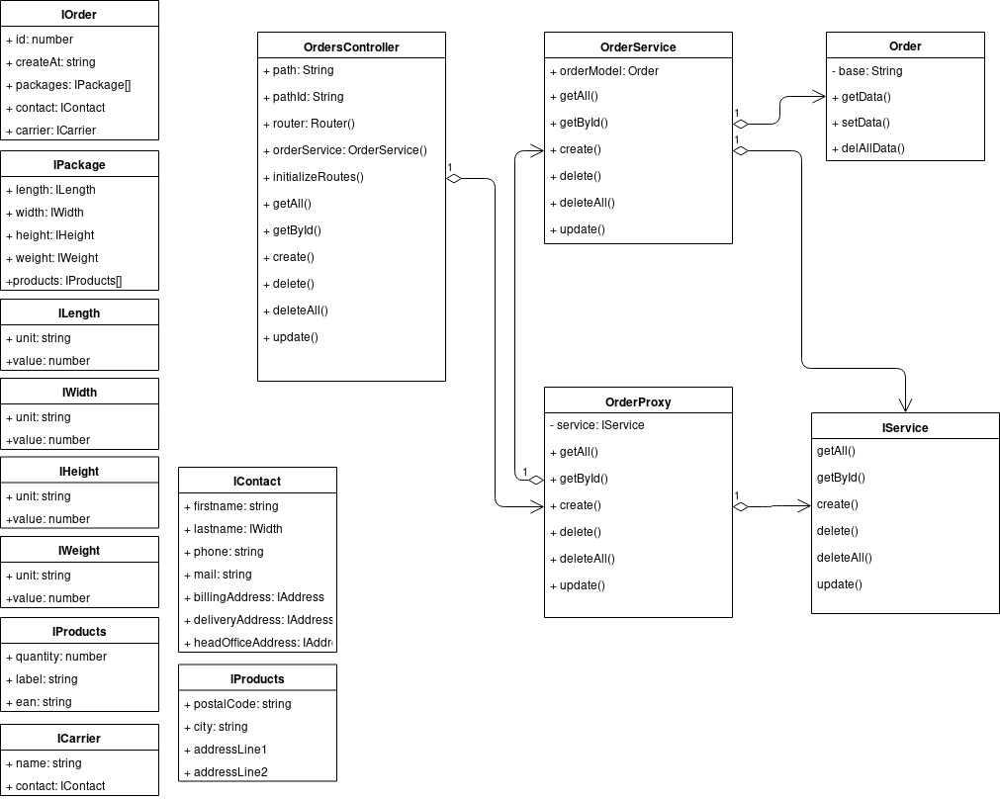

# TypeScript Express server - Vandermeiren Maximilien

## Answers to the questions

1. I just reused the file from the correction.
2. After checking the order.example.ts file, I recreated it with a class. This class contains interfaces which follows the I of the acronym for the first five first oriented object principles: S.O.L.I.D. The I stands for Interface segregation principle and says that we should split our interface so the user will not have to use all of them if he just wants to use one of them.
3. The principle used for this is the S of S.O.L.I.D. It says that a class should have only one responsability. The Design Patern I used is called Adapter.
4. I used a Proxy to secure the private informations from contact.
5.  This principle is the MVC which is made to separate Models, Views and Controllers.
6. 


## Get started

Ensure you have `make` installed on your system.

After cloning the repository run:
```bash
make init
```

Now you can start|stop|restart your server by running:
```bash
make start|stop|restart
```

Your server will listen by default on port `3000` of your `$DOCKER_HOST`

You can access the server logs by running:
```bash
make log
```

If you want to stop and destroy your docker containers:
```bash
make down
```

Launch dependencies install with:
```bash
make install
```

## Running a command in a running container

To run a command in your container, run the following:
```bash
docker exec <container_name> <command>
```
eg:

```bash
docker exec starter-back_server sudo rm -rf /
```

## Running a command in a stopped/failed container

You will have to run a command through `docker-compose`:
```bash
docker-compose run --rm <service_name> <command>
```
eg:

```bash
docker-compose run --rm node npm install --save-dev typescript
```

## Access your container

To connect to a container, run:
```bash
docker exec -ti <container_name> sh
```
